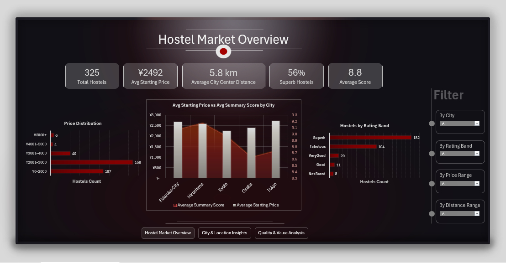

# Japan Hostel Market Analysis (Automated Python & Excel Power Pivot Dashboard)

## Overview
An interactive Excel market analysis dashboard exploring pricing strategies, rating distributions, and geographic metrics across major Japanese cities (Tokyo, Osaka, Kyoto, Hiroshima, Fukuoka). 

The workflow replaces manual Excel data preparation with an automated Python cleaning pipeline in Google Colab, leveraging Gemini AI to streamline raw data processing before building a dynamic Power Pivot DAX model in Excel.

- **Tools & Tech:** Python (Pandas / Google Colab / Gemini AI), Excel (Power Pivot, DAX, Dynamic PivotTables, Slicers, Custom UI/UX)
- **Dataset:** Japan Hostels Dataset

---

## Technical Pipeline & Design

1. **Automated Cleaning (Python & Gemini AI):** 
   - Moved from manual Excel prep to Google Colab, utilizing Python (Pandas) and Gemini AI assistance to refine, clean, and automate dataset transformation.
2. **Robust Data Modeling (Power Pivot & DAX):** 
   - Loaded structured data into Excel's Power Pivot engine to compute core KPI metrics using custom DAX measures.
3. **Dynamic UX & Interactive Engine:** 
   - Leveraged dynamic PivotTables as the backing engine for real-time KPI cards, linked cross-filters, and multi-tab visual navigation (`Hostel Market Overview`, `City & Location Insights`, `Quality & Value Analysis`).

---

## 🔍 Key Insights Discovered

1. **The Price-Perception Gap:** High-priced hostels do not automatically score high value ratings. The model highlights specific market clusters where price outpaces customer sentiment—identifying immediate signals for revenue management optimization.
2. **Location is King:** Proximity to the city center remains the strongest single driver of premium ratings. Guests consistently vote for location convenience in review scores.
3. **High Baseline Quality Across Tiers:** Budget-friendly hostels across Japan consistently secure top-tier rating bands, demonstrating a remarkably high nationwide service baseline regardless of price entry point.

---

## Repository Files

* `README.md` - Project documentation and findings summary.
* `JHostelsFinal.xlsx` - Master Excel workbook containing Power Pivot data model, DAX calculations, and interactive dashboard sheets.
* `raw_jhostel_data.xlsx` & `cleaned_jhostel_data.csv` - Raw and post-processing datasets.
* `clean_jhostel_data.ipynb` - Google Colab notebook for automated Python data cleaning.
* `JH1.jpg`, `JH2.jpg`, `JH3.jpg` - Dashboard interface screenshots.

---

## Author
* **LinkedIn:** [Tayseer Ismail](https://www.linkedin.com/in/tayseer-ismail/)
* **GitHub:** [@tayseer-ismail](https://github.com/tayseer-ismail)
